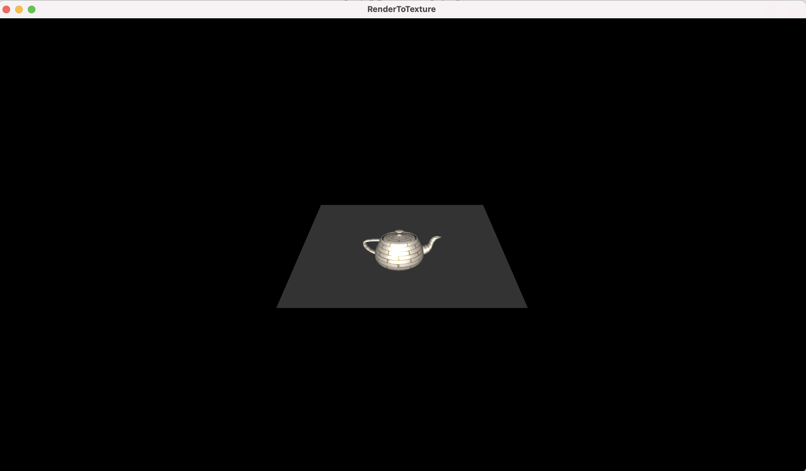
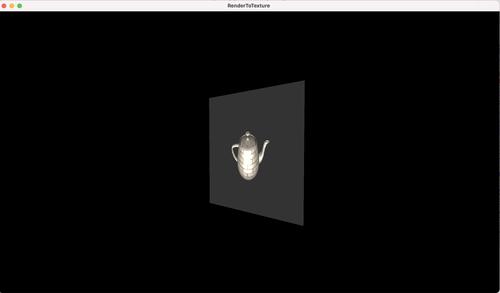
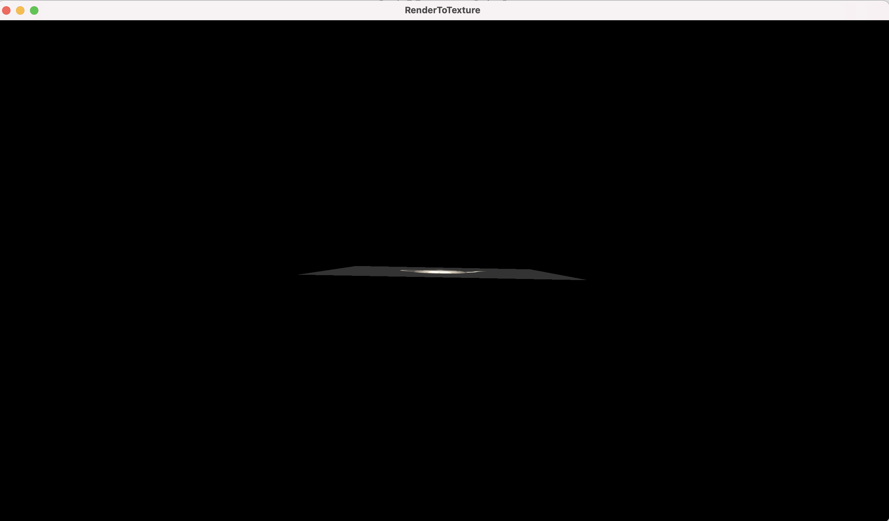
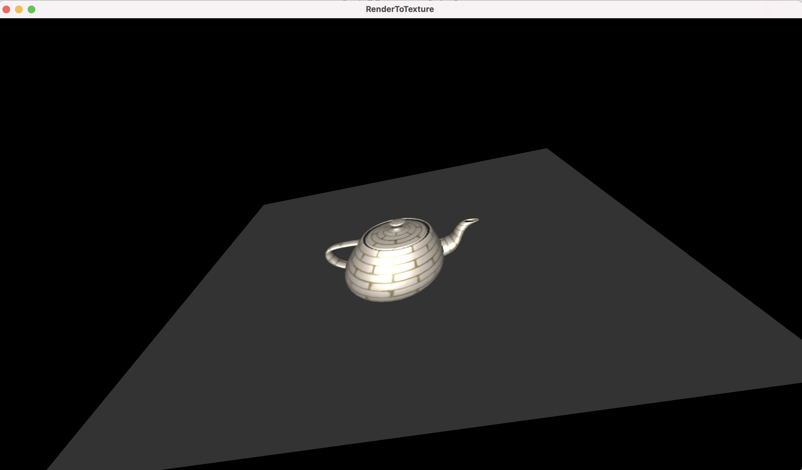
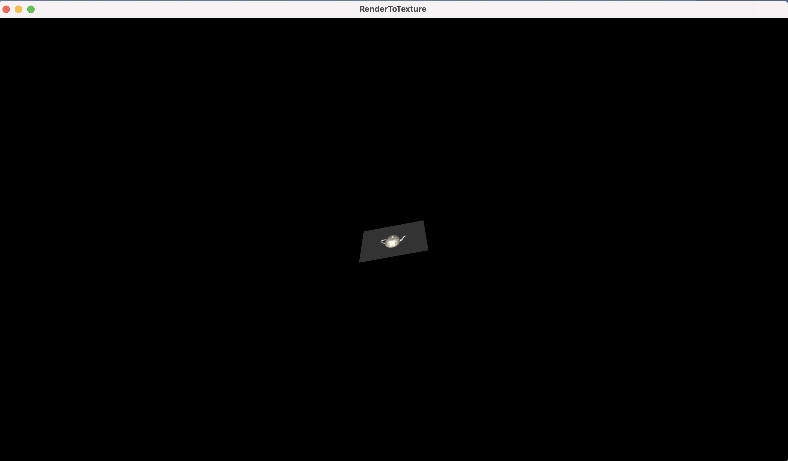
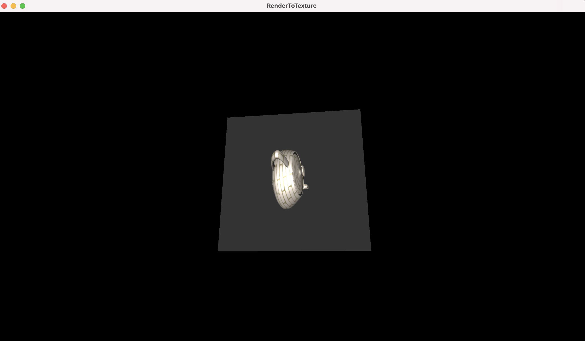
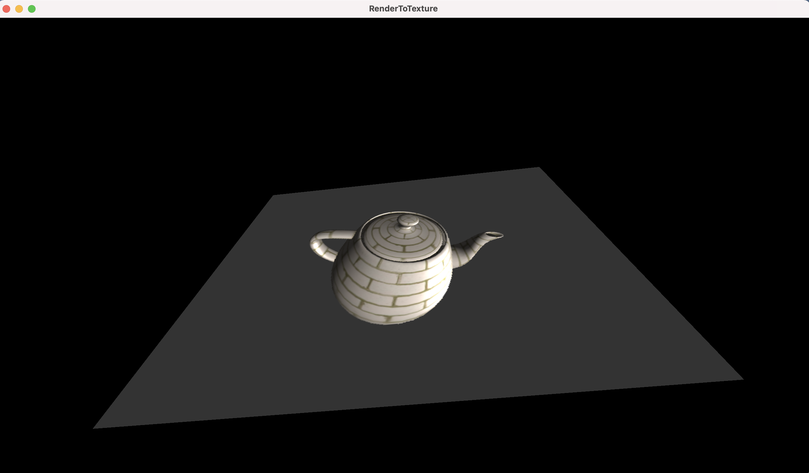

Project 5

Rendering of the plane with the render to texture applied on it

Rendering of the rotated plane with the render to texture applied on it

Rendering of the zoomed plane with the rotated teapot render to texture applied on it

Rendering of the rotated plane with render to texture applied on it of the rotated teapot

Rendering of the rotated plane with the render to texture of the rotated teapot with the light source rotated

In addition to the previous project

1. A new vertex and fragment shader was created to process the vertices for the plane and shade it with the render-to-texture sampled texture.
2. The vertices for the plane was manually set to form a square consisting of 2 triangles
3. The texture coordinates for the plane was set to each corner using st-coordinate of the render-to-texture texture.
4. In the main render loop
  1. Using cy::GL renderbuffer, a framebuffer, a texture as well as a depth buffer was created. The viewport of the framebuffer was set to the output texture size.
  2. The framebuffer was bound to the texture and the depth buffer
  3. The target framebuffer was set to the new render-to-texture framebuffer.
  4. The draw calls to draw the object with the texture resulted in the object drawn into the render-to-texture framebuffer.
  5. The backbuffer was set as the current target framebuffer.
  6. The plane VBO for the vertices and texture coordinates were bound.
  7. The render-to-texture was bound and made active
  8. The plane with the render-to-texture texture was drawn.
  9. The OPTION/ALT key press action was used to enable mouse input to change the rotation/zoom of the plane.

How to use your implementation

1. Compile the texture.cpp file, cyCodeBase must be present in the include path

clang++ -std=c++11 -stdlib=libc++ RenderToTexture.cpp lodepng.cpp -o RenderToTexture -lglfw -lglew -framework OpenGL -I/Users/u1316087/Downloads/homebrew/include/ -L/Users/u1316087/Downloads/homebrew/lib/

1. Run the executable

./RenderToTexture teapot.obj

1. Controls

The mouse left button with CNTRL enables rotating the light source in world space.

The mouse left/right button with OPTION/ALT pressed controls the plane

The mouse left/right button pressed controls the object.

What operating system and compiler you used
 Operating System: macOS 11.3 Big Sur

GLFW version: 3.3.6

GLEW version: 2.2.0\_1

Compiler:
 Apple clang version 12.0.5 (clang-1205.0.22.11) Target: x86\_64-apple-darwin20.4.0

External libraries and additional requirements to compile the project.

cyCodeBase, GLFW and GLEW are required
